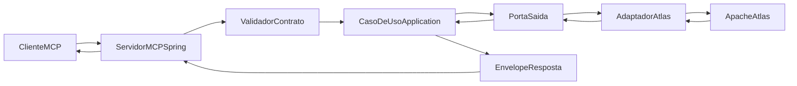

# Camadas do servidor MCP

## Propósito

Mapear cada tool MCP da v1 à porta Java correspondente, ao contrato JSON canônico e ao erro padronizado, garantindo rastreabilidade entre desenho lógico, código e taxonomia experimental.

## Leitor

Pessoa desenvolvedora Java que implementa, evolui ou testa o servidor MCP.

## Pré-requisitos

- [`visao-logica.md`](visao-logica.md)
- [`modelo-dominio.md`](modelo-dominio.md)
- [`../07-contratos-mcp/contracts-v1.md`](../07-contratos-mcp/contracts-v1.md)

## Conteúdo

### Modelo de camadas para uma chamada MCP

### Tabela `tool -> porta Java -> contrato JSON -> erro canônico`

| Tool MCP | Caso de uso | Porta de saída | Adapter concreto | Contrato JSON | Erros canônicos possíveis |
|----------|-------------|----------------|------------------|---------------|---------------------------|
| `catalog.listTables` | `ListTablesUseCase` | `MetadataLookupPort.listTables(schema, limit, cursor)` | `AtlasMetadataAdapter` | Ver `catalog.listTables` em [`contracts-v1.md`](../07-contratos-mcp/contracts-v1.md) | `invalid_input`, `catalog_unavailable`, `timeout`, `internal_error` |
| `catalog.describeTable` | `DescribeTableUseCase` | `MetadataLookupPort.describeTable(schema, table)` | `AtlasMetadataAdapter` | Ver `catalog.describeTable` em [`contracts-v1.md`](../07-contratos-mcp/contracts-v1.md) | `invalid_input`, `not_found`, `catalog_unavailable`, `timeout`, `internal_error` |
| `catalog.listRelationships` | `ListRelationshipsUseCase` | `MetadataLookupPort.listRelationships(schema, table)` | `AtlasMetadataAdapter` (consulta manifesto de FKs quando o Atlas não tem relação modelada) | Ver `catalog.listRelationships` em [`contracts-v1.md`](../07-contratos-mcp/contracts-v1.md) | `invalid_input`, `not_found`, `catalog_unavailable`, `timeout`, `internal_error` |

### Envelope padrão

Todas as tools retornam o envelope `{runId, toolVersion, status, data, error}` definido em [`contracts-v1.md`](../07-contratos-mcp/contracts-v1.md). Em caso de erro, `status = "error"`, `data = null`, `error` preenchido com código canônico e mensagem.

### Política de tool budget

- Cada `QuerySession` carrega um `ToolBudget` (valor numérico configurado por corrida).
- Orçamento padrão de referência: **6 chamadas por sessão** (uma sessão por pergunta), alinhado ao capítulo metodológico.
- Cada chamada de tool decrementa o orçamento.
- Atingir o orçamento encerra a sessão com `RunRecord` marcado como `budget_exceeded` (registrado no harness, não no envelope MCP).

### Convenções de implementação

- Pacote: `com.tcc.text2sql.adapters.in.mcp` (servidor) e `com.tcc.text2sql.adapters.out.atlas` (adapter). Ver [`../06-implementacao-java/modulos-spring.md`](../06-implementacao-java/modulos-spring.md).
- Validação de entrada com Bean Validation (`jakarta.validation`).
- Timeout por chamada: configurável; default sugerido 5 s para Atlas.
- Retry com backoff exponencial limitado a 2 tentativas para `catalog_unavailable` ou `timeout`.

### Versionamento

- `toolVersion` segue o `vMAJOR.MINOR.PATCH` descrito em [`contracts-v1.md`](../07-contratos-mcp/contracts-v1.md).
- Quebra de contrato implica nova versão `MAJOR` e ADR específico.

## Próximo passo

[`../04-arquitetura-dados/catalogo-atlas.md`](../04-arquitetura-dados/catalogo-atlas.md)
