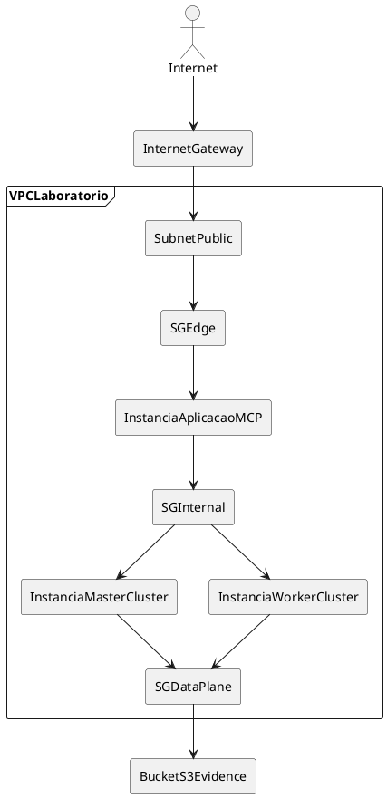

# Visão de infraestrutura AWS

## Propósito

Descrever, em alto nível, como o ambiente laboratorial AWS hospeda o cluster, a aplicação MCP e os artefatos de observabilidade, mapeando as zonas lógicas de rede para VPC, subnets e security groups.

## Leitor

Pessoa que provisiona a infraestrutura AWS (mesmo sem escrever Terraform agora) ou que valida sua coerência com o desenho lógico.

## Pré-requisitos

- [`../03-arquitetura-aplicacao/visao-logica.md`](../03-arquitetura-aplicacao/visao-logica.md) (zonas lógicas de rede)
- [`delta-oci-para-aws.md`](delta-oci-para-aws.md)
- [`cluster-hadoop.md`](cluster-hadoop.md)

## Conteúdo

### Premissas

- Conta AWS de estudo, sem dependência de tenant corporativo.
- Região única (a definir; sugestão: `sa-east-1` ou `us-east-1` por custo).
- Infraestrutura provisionada por Terraform (o código não faz parte do escopo deste TCC; documenta-se apenas a topologia alvo).

### Topologia alvo (versão mínima)

Diagrama em arquivo: [`../diagrams/cluster-topologia-aws.puml`](../diagrams/cluster-topologia-aws.puml) e [`../diagrams/rede-aws.puml`](../diagrams/rede-aws.puml).

### Mapeamento de zonas lógicas para AWS

| Zona lógica (visão-logica.md) | Recurso AWS | Função |
|-------------------------------|-------------|--------|
| `NetPublic` | Subnet pública + Security Group de entrada (porta 443/22 restrita por IP). | Recebe a pergunta no orquestrador. |
| `NetInternalApp` | Subnet privada + SG de aplicação. | Hospeda a aplicação MCP. |
| `NetDataPlane` | Subnet privada de dados + SG do cluster (acesso restrito ao master/worker). | Atlas, HDFS, Hive Metastore, banco PS. |
| `NetObservability` | Bucket S3 dedicado + IAM role da aplicação. | Evidências por `runId`, retenção sem sobrescrita. |

### Recursos por categoria

| Categoria | Recurso AWS | Tamanho/nota | Estado |
|-----------|-------------|--------------|--------|
| Rede | VPC `/24` | Equivalente ao `vcn-data-lake` (ver [`delta-oci-para-aws.md`](delta-oci-para-aws.md)). | Definir Terraform |
| Rede | Subnets pública + privada | Mínimo 2 subnets em AZs diferentes para futuro HA. | Definir Terraform |
| Computação | EC2 master (1 instância) | `m6i.2xlarge` (8 vCPU, 32 GiB), Atlas co-localizado. | Definido (ADR-0002) |
| Computação | EC2 workers (3 instâncias) | `m6i.2xlarge` (8 vCPU, 32 GiB) para HDFS/YARN/Hive/HBase/Kafka. | Definido (ADR-0002) |
| Computação | EC2 aplicação MCP (1 instância) | `m6i.2xlarge` (8 vCPU, 32 GiB), nó dedicado na topologia alvo (`NetInternalApp`); co-localização no master apenas como contingência de MVP. | Definido (visão AWS) |
| Armazenamento | EBS por instância | gp3 >= 100 GiB por nó do cluster (master e workers), com replicação HDFS 3. | Definido |
| Armazenamento | Bucket S3 (evidências) | Versionamento ativado, retenção. | Definir |
| Segurança | Security Groups (3+: edge, app, data). | `deny by default`. | Definir |
| Segurança | IAM roles (EC2 -> S3) | Mínimo privilégio. | Definir |
| Acesso | Bastion ou Session Manager (preferível) | Evitar exposição SSH direta. | Decisão de operação |

### Diferenças face ao laboratório OCI de referência

A pasta [`../legacy-infra/`](../legacy-infra/index.md) contém o laboratório OCI de referência (ODP 1.2.2.0 em ARM). As principais diferenças para o alvo AWS x86 estão consolidadas em [`delta-oci-para-aws.md`](delta-oci-para-aws.md).

### Custos e dimensionamento

- Estimativa de custo mensal fica para a fase operacional, após provisionamento real e medição de uso.
- Premissa: ambiente de estudo, ligado sob demanda durante corridas, não 24/7.

## Próximo passo

[`cluster-hadoop.md`](cluster-hadoop.md)
