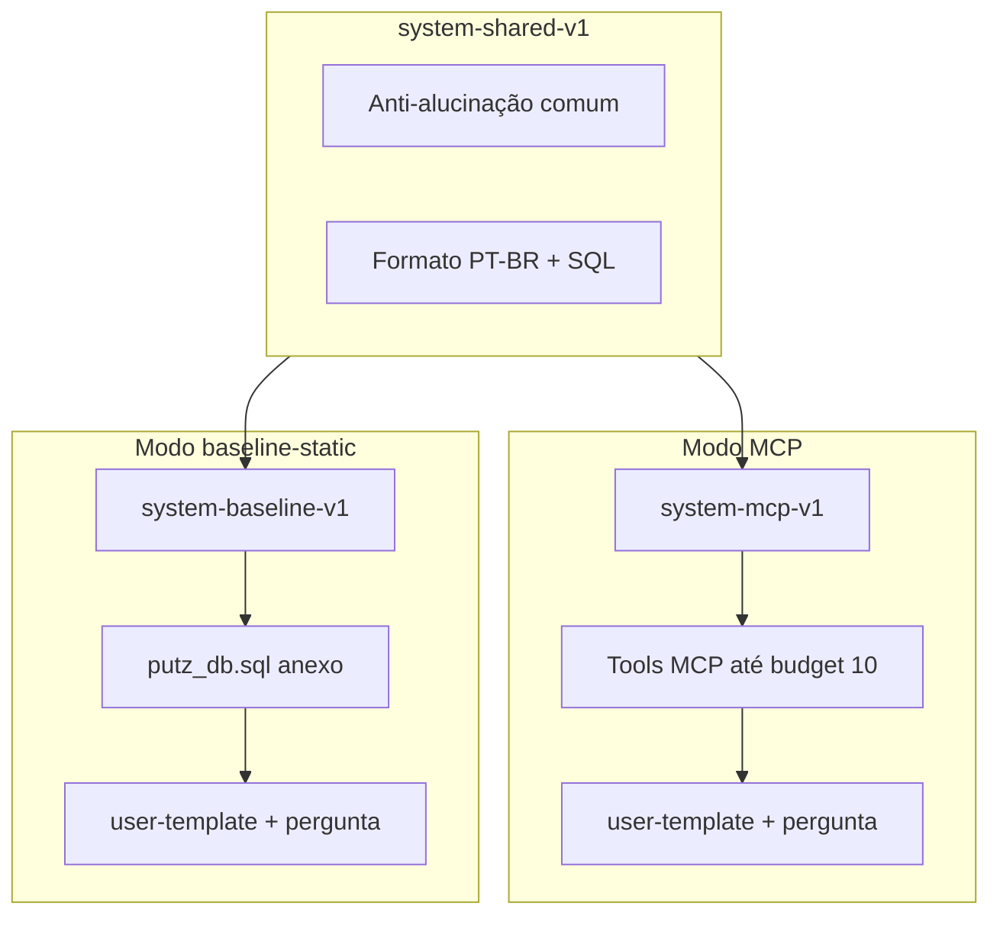

# Inferência LLM e prompts experimentais

## Propósito

Fixar hiperparâmetros de decodificação, montagem de prompts (system e user) e registro em `context.json`
para as campanhas `mcp` e `baseline-static`, eliminando confounds operacionais na comparação experimental.

## Leitor

Pessoa que configura o orquestrador LLM, executa corridas ou implementa o adaptador `SpringAiLlmAdapter`.

## Pré-requisitos

- [`protocolo-avaliacao.md`](protocolo-avaliacao.md)
- [`runbook-reprodutibilidade.md`](runbook-reprodutibilidade.md)
- [`../06-implementacao-java/modulos-spring.md`](../06-implementacao-java/modulos-spring.md)
- Templates: [`../../templates/prompts/prompts-manifest-v1.json`](../../templates/prompts/prompts-manifest-v1.json)
- Schema: [`../../evidence/context-schema-v1.json`](../../evidence/context-schema-v1.json)

## Conteúdo

### Política de inferência v1

| Parâmetro | Google (`gemini-3.5-flash`) | OpenAI (`gpt-5.4-nano`) | Registro em `context.json` |
|-----------|------------------------------|-------------------------|----------------------------|
| `temperature` | **0** | **N/A** (modelo de raciocínio) | `inferenceConfig.temperature` ou `null` |
| `temperatureSupported` | `true` | `false` | `inferenceConfig.temperatureSupported` |
| `topP` | omitido (`null`) | omitido (`null`) | `inferenceConfig.topP` |
| `topK` | omitido (default do provedor) | N/A | não registrar |
| `maxOutputTokens` | **4096** | **4096** | `inferenceConfig.maxOutputTokens` |
| `maxInputTokens` | limite do modelo (não fixar no harness v1) | idem | `null` ou omitido |
| `frequencyPenalty` | omitido / 0 | omitido | não registrar v1 |
| `presencePenalty` | omitido / 0 | omitido | não registrar v1 |
| `seed` | explícita por campanha | explícita por campanha | `seed` (raiz) |

**Regras:**

1. **`temperature = 0`** na campanha baseline v1 (Gemini). O default Spring AI para Google é 0,7 — **sobrescrever
   explicitamente**.
2. **Não definir `topP` junto com `temperature`** (recomendação Spring AI).
3. Modelos GPT-5 de raciocínio (`gpt-5.4-nano`) **rejeitam** `temperature`; registrar
   `temperatureSupported: false` e omitir o parâmetro no request.
4. **`seed`** permanece obrigatória, mas APIs comerciais **não garantem** determinismo total mesmo com
   `temperature=0` — documentar como variância residual (ver § Limitações).

Referências de integração: [`../../../guide-docs/external-documentation/SpringAi-google.md`](../../../guide-docs/external-documentation/SpringAi-google.md),
[`../../../guide-docs/external-documentation/SpringAi-openai.md`](../../../guide-docs/external-documentation/SpringAi-openai.md).

### Montagem do prompt

```text
Modo MCP (campaignId: mcp)
  system  = system-shared-v1.md + system-mcp-v1.md
  user    = user-template-v1.md
            + {{QUESTION_TEXT}}
            + (opcional) snapshot de metadados pós-tools

Modo baseline-static
  system  = system-shared-v1.md + system-baseline-v1.md
  user    = user-template-v1.md
            + {{QUESTION_TEXT}}
            + putz_db.sql (DDL integral anexo)
```

Diagrama:



### Regra de paridade (anti-confound)

1. **Todo** texto anti-alucinação estrutural reside em [`system-shared-v1.md`](../../templates/prompts/system-shared-v1.md)
   e deve ser **idêntico** entre modos.
2. Diferença material permitida:
   - **MCP:** instruções de descoberta via tools; sem DDL integral no prompt.
   - **Baseline:** instruções de uso do DDL anexo; `toolBudget: 0`.
3. É **proibido** enriquecer o system prompt MCP com regras textuais que não existam no baseline (ex.:
   «não invente tabelas» só no MCP).

### Versionamento e congelamento

| Campo | Valor v1 |
|-------|----------|
| `promptVersion` | `"v1"` |
| `inferenceConfigVersion` | `"v1"` |
| Manifesto | [`prompts-manifest-v1.json`](../../templates/prompts/prompts-manifest-v1.json) |

Antes de **qualquer** corrida da campanha:

1. Congelar templates + properties + lista de tools em um `commitHash`.
2. Calcular `promptArtifactsHash` (SHA-256 da concatenação ordenada dos quatro ficheiros `.md` do manifesto).
3. Gravar `commitHash`, `promptVersion`, `inferenceConfigVersion`, `promptArtifactsHash` e `inferenceConfig` em
   `context.json` de **cada** corrida.

### Schema `context.json`

Canónico: [`../../evidence/context-schema-v1.json`](../../evidence/context-schema-v1.json).

Exemplos:

- Baseline: [`../../evidence/examples/context-baseline-v1.example.json`](../../evidence/examples/context-baseline-v1.example.json)
- MCP: [`../../evidence/examples/context-mcp-v1.example.json`](../../evidence/examples/context-mcp-v1.example.json)

### Mapeamento Spring AI

| Property (sugestão) | Campo `context.json` | Notas |
|----------------------|----------------------|-------|
| `app.llm.provider` | `provider` | `google` ou `openai` |
| `app.llm.google.model-version` | `modelVersion` | ex.: `gemini-3.5-flash` |
| `app.llm.openai.model-version` | `modelVersion` | ex.: `gpt-5.4-nano` |
| `app.llm.google.temperature` | `inferenceConfig.temperature` | fixar `0` |
| `app.llm.openai.temperature` | — | omitir se `temperatureSupported: false` |
| `app.llm.*.max-output-tokens` | `inferenceConfig.maxOutputTokens` | `4096` |
| `app.llm.prompt.version` | `promptVersion` | `v1` |
| `app.llm.prompt.base-path` | `promptArtifacts.*` | raiz dos templates |

O adaptador `SpringAiLlmAdapter` deve serializar a configuração efetiva do request e o hash dos templates
em `context.json` via `RunEvidencePort` (ver [`../06-implementacao-java/ports-adapters.md`](../06-implementacao-java/ports-adapters.md)).

Equivalentes Spring AI (Google):

```properties
spring.ai.google.genai.chat.options.temperature=0
spring.ai.google.genai.chat.options.max-output-tokens=4096
```

OpenAI (`gpt-5.4-nano`): não definir `temperature`; definir `max-output-tokens` conforme documentação do
modelo.

### Limitações de validade

1. **Determinismo imperfeito:** `temperature=0` e `seed` reduzem variância, mas provedores comerciais podem
   produzir SQL distinto entre corridas.
2. **D12 (baseline):** DDL integral no prompt aumenta contexto de entrada e constitui ameaça à validade
   interna do comparativo — ver [`runbook-reprodutibilidade.md`](runbook-reprodutibilidade.md) § Limitação D12.
3. **Revisão humana:** o rascunho operacional v1 dos templates está sujeito à aprovação do autor antes do
   congelamento da campanha.

Decisão formal: [`../../adr/ADR-0003-inferencia-llm-deterministica.md`](../../adr/ADR-0003-inferencia-llm-deterministica.md).

## Próximo passo

[`runbook-reprodutibilidade.md`](runbook-reprodutibilidade.md)
