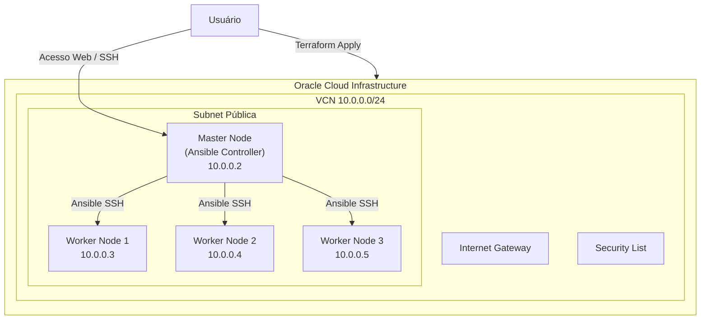
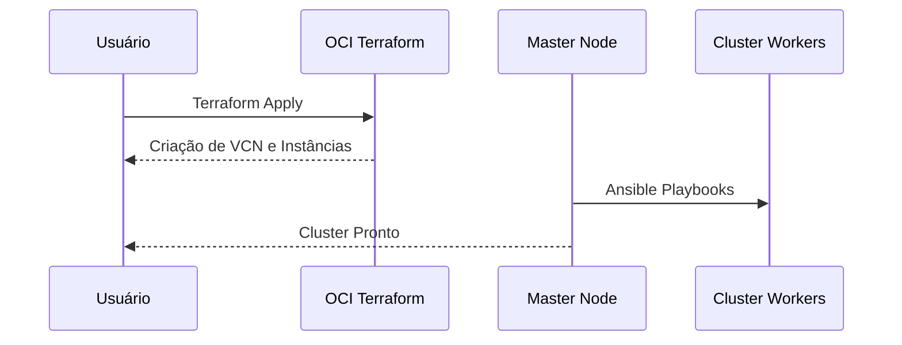

# Infraestrutura legado OCI

> **Nota:** Esta pasta descreve legado OCI e **não** é o alvo do TCC. O alvo é AWS x86 com stack ODP documentada na [Monografia](../monografia.md). Preserva-se apenas como referência de migração (ODP 1.2.2.0, `centos9-aarch64`).

O código Terraform e Ansible permanece em `legacy-infra/` na raiz do repositório (fora do site publicado). Para o delta OCI → AWS, ver [Delta OCI para AWS](../05-infraestrutura/delta-oci-para-aws.md).

## Objetivo

Framework de infraestrutura como código que provisiona um cluster Big Data em OCI (Oracle Cloud Infrastructure), com Ambari/Hadoop em instâncias ARM (Ampere) e Oracle Linux 9.

## Arquitetura (OCI)

## Fluxo de provisionamento

